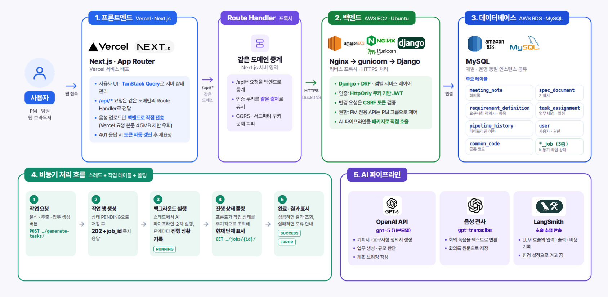

# Heyzzabi | 회의에서 업무 배정까지 이어지는 AI 협업 도구

<p align="center"></p>

회의 내용을 바탕으로 기획서와 요구사항 정의서를 만들고, 업무 분해와 담당자 추천까지 이어 주는 팀 프로젝트입니다. AI가 초안을 작성하면 PM이 단계별로 검토하고 승인합니다. 이 저장소는 SKN31 31기 1팀 프로젝트의 **공개용 소스 복사본**입니다.

## 주요 기능

- 회의록을 근거로 기획서와 요구사항 정의서 초안 생성
- 요구사항을 Epic, Task, Subtask로 분해하고 예상 공수 및 필요 스킬 산정
- 사원 정보와 가용 시간을 이용한 담당자 추천 및 일정 계산
- 생성 근거 확인, 승인·반려, 작업 상태 조회와 파이프라인 이력 확인

<p align="center"></p>

## 기술 구성

| 영역 | 기술 |
| --- | --- |
| 프론트엔드 | Next.js, React, TypeScript, TanStack Query |
| 백엔드 | Python, Django, Django REST Framework |
| AI | OpenAI API, Python 에이전트 파이프라인 |
| 데이터베이스 | 로컬 SQLite 또는 MySQL |
| 배포에 사용한 구성 | Vercel, Nginx, Gunicorn, AWS EC2/RDS |

<p align="center"></p>

## 저장소 구성

```text
ai/                  AI 파이프라인, 프롬프트, 테스트
backend/             Django API 및 관리 명령
frontend/            Next.js 웹 앱
artifacts/load-test/ 로컬 부하 테스트 스크립트
산출물/images/        README에 사용하는 이미지
```

공개용 복사본에는 DB, 계정 시드, 실제 환경 변수, 로그, 실행별 부하 테스트 결과와 문서 원본을 넣지 않았습니다. 포함 범위는 [공개용 검토 메모](PUBLIC_RELEASE_NOTES.md)에 기록했습니다.

## 로컬 실행

Python 3.12 이상, Node.js 20 이상과 npm이 필요합니다. AI 기능을 호출하려면 개인 OpenAI API 키가 필요합니다. 아래 명령은 저장소 루트에서 실행합니다.

### 1. 백엔드

```bash
cd backend
python3 -m venv .venv
source .venv/bin/activate        # Windows PowerShell: .venv\Scripts\Activate.ps1
python -m pip install -r requirements.txt
cp .env.example .env             # Windows PowerShell: Copy-Item .env.example .env
python -c "from django.core.management.utils import get_random_secret_key; print(get_random_secret_key())"
```

출력된 값을 `backend/.env`의 `SECRET_KEY`에 넣고, AI 기능을 사용할 경우 `OPENAI_API_KEY`도 설정합니다. 로컬 SQLite를 사용하려면 MySQL 접속 항목은 비워 둡니다. `.env`는 커밋하지 마세요.

```bash
python manage.py migrate
python manage.py runserver
```

### 2. 프론트엔드

별도 터미널에서 실행합니다.

```bash
cd frontend
npm ci
npm run dev
```

브라우저에서 `http://localhost:3000`을 엽니다. API 기본 주소가 다르면 `frontend/.env.local`에 `NEXT_PUBLIC_API_BASE_URL=http://localhost:8000`처럼 설정합니다. 자세한 설정은 [백엔드 안내](backend/backend_readme.md)와 [프론트엔드 안내](frontend/README.md)를 참고하세요.

## 검증 범위

`test` 브랜치에서 로컬 API 조회, AI 모의 Job, 상태 폴링과 동일 문서 동시 요청을 시험했습니다. 예를 들어 일반 조회 20명·5분·3회 시험의 전체 p95는 회차별 129.4 / 114.9 / 111.5ms였고, 각 회차의 예상 밖 오류는 0건이었습니다. 이 수치는 테스트 전용 데이터베이스와 로컬 장비에서 얻은 관찰값이며 운영 환경의 처리 용량을 뜻하지 않습니다. 원시 로그와 실행 결과는 이 공개용 복사본에 포함하지 않았습니다.

테스트 스크립트는 [`artifacts/load-test`](artifacts/load-test)에 있습니다. 이 스크립트들은 전용 MySQL 테스트 DB와 테스트 계정을 요구합니다. 일반 기능 검증은 백엔드의 Django 테스트와 프론트엔드의 `npm test`를 사용할 수 있습니다.

## 기여자

SKN31 31기 1팀: 박연아, 김가율, 김재원, 이재일, 박하린. 공개와 라이선스 범위는 팀 확인 후 확정해야 합니다.
